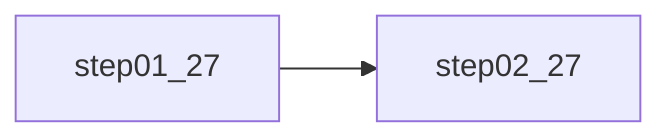
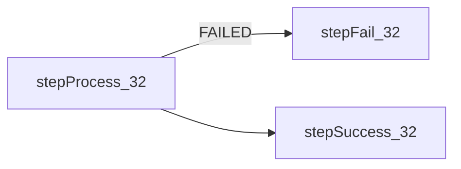
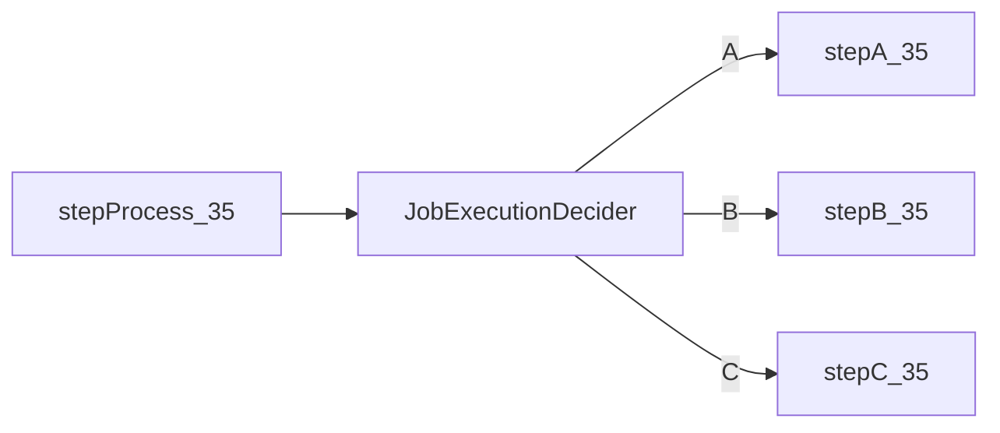

# Spring Batch Step
## 🍃Tasklet處理模式
循環執行Step邏輯，直到`Tasklet.execute()`返回`RepeatStatus.FINISHED`才會執行下一步驟，用法可參考：[[🍃SpringBatch_01_HelloWorld#啟動類]]

```java
// 實現Tasklet並實作execute()即可
public interface Tasklet {  
    @Nullable  
    RepeatStatus execute(StepContribution var1, ChunkContext var2) throws Exception;  
}
```
- `StepContribution`，步驟信息對象，用於保存當前步驟執行狀況
	```java
	// 主要用於設置步驟結果狀態
	stepContribution.getStepExecution().getJobExecution().setExitStatus(ExitStatus.COMPLETED);
	```
- `ChunkContext`，Chunk上下文，用於記錄Chunk塊執行場景
- `RepeatStatus`，當前步驟狀態
	- `RepeatStatus.FINISHED`，表示當前步驟執行結束
	- `RepeatStatus.CONTINUABLE`，表示此步驟重新執行

## 🍃Chunk處理模式
- 相比於`Tasklet`多了三個模塊：
	
	
	- `ItemReader`，讀模塊，會一直循環調用，直到返回`null`才停止
	- `ItemProcessor`，處理模塊，處理模塊的處理次數是跟隨讀模塊，也就是讀幾次就處理幾次
	- `ItemWriter`，寫模塊，一次性處理所有數據
- Chunk處理步驟
	```mermaid
	sequenceDiagram
	    Step->>+ItemReader: read()
	    ItemReader-->>-Step: Item
	    Step->>+ItemProcessor: process(item)
	    ItemProcessor-->>-Step: Item
	    Step->>+ItemProcessor: process(item)
	    ItemProcessor-->>-Step: Item
	    Step->>+ItemWriter: write(items)
	```

```java
@SpringBootApplication
@EnableBatchProcessing
public class T30_JobChunkTest {
    public static void main(String[] args) {
        SpringApplication.run(T30_JobChunkTest.class, args);
    }

    @Autowired
    private JobLauncher jobLauncher;

    @Autowired
    private JobBuilderFactory jobBuilderFactory;

    @Autowired
    private StepBuilderFactory stepBuilderFactory;

    private int loopSize = 4;

    // 讀模塊
    @Bean
    public ItemReader<String> t30_ItemReader(){
        return new ItemReader<String>() {
            @Override
            public String read() throws Exception, UnexpectedInputException, ParseException, NonTransientResourceException {
                if(loopSize <= 0){
                    return null; // 停止讀取
                }
                System.out.println("t30_ItemReader() : " + loopSize);
                loopSize--;
                return "test class 30";
            }
        };
    }

    // 處理模塊
    @Bean
    public ItemProcessor<String, String> t30_ItemProcessor(){
        return new ItemProcessor<String, String>() {
            @Override
            public String process(String o) throws Exception {
                System.out.println("t30_ItemProcessor()");
                return String.format("processing --> %s", o);
            }
        };
    }

    // 寫模塊
    @Bean
    public ItemWriter<String> t30_ItemWriter(){
        return new ItemWriter<String>() {
            @Override
            public void write(List<? extends String> list) throws Exception {
                System.out.println(list.toString());
            }
        };
    }

    @Bean
    public Step step01_30() {
        return this.stepBuilderFactory.get("step_01") //
                // 注意：如果有指定處理類型，則需要另外在此指定泛型
                .<String, String> chunk(3) // 參數設置一次處理多少數據
                .reader(this.t30_ItemReader()) // 設置讀模塊
                .processor(this.t30_ItemProcessor()) // 設置處理模塊
                .writer(this.t30_ItemWriter()) // 設置寫模塊
                .build();
    }

    @Bean
    public Job job_30() throws Exception {
        return this.jobBuilderFactory.get("t30_job") //
                .start(this.step01_30()) //
                .incrementer(new RunIdIncrementer()) // 自增器
                .build();
    }
}
```

## 🍃步驟監聽器
和[[🍃SpringBatch_02_Job#🍃作業監聽器]]概念類似，根據處理模式，監聽器可分為：`StepExecutionListener`(Tasklet使用)、`ChunkListener`(Chunk使用)。使用方法都是實現接口並覆寫方法，以下只記錄`StepExecutionListener`使用

1. 新建自定義步驟執行監聽器，實現`StepExecutionListener`接口
	```java
	// 自定義步驟執行監聽器
	public class T32_StepListener implements StepExecutionListener {
	    // 步驟執行前
	    @Override
	    public void beforeStep(StepExecution stepExecution) {
	        System.out.println("T32_StepListener.beforeStep()");
	    }
	
	    // 步驟執行後
	    @Override
	    public ExitStatus afterStep(StepExecution stepExecution) {
	        System.out.println("T32_StepListener.afterStep()");
	        return stepExecution.getExitStatus(); // 必要改動
	    }
	}
	```
2. 設置自定義步驟執行監聽器
	```java
	@SpringBootApplication
	@EnableBatchProcessing
	public class T32_StepListenerTest {
	    public static void main(String[] args) {
	        SpringApplication.run(T32_StepListenerTest.class, args);
	    }
	
	    @Autowired
	    private JobLauncher jobLauncher;
	
	    @Autowired
	    private JobBuilderFactory jobBuilderFactory;
	
	    @Autowired
	    private StepBuilderFactory stepBuilderFactory;
	
	    // 步驟監聽器
	    @Bean
	    public T32_StepListener t32_StepListener(){
	        return new T32_StepListener();
	    }
	
	    @Bean
	    public Step step01_32() {
	        return this.stepBuilderFactory.get("step_01") //
	                .tasklet(new Tasklet() {
	                    @Override
	                    public RepeatStatus execute(StepContribution stepContribution, ChunkContext chunkContext) throws Exception {
	                        System.out.println("Do Something...");
	                        return RepeatStatus.FINISHED;
	                    }
	                }) //
	                .listener(this.t32_StepListener()) // 設置步驟監聽器
	                .build();
	    }
	
	    @Bean
	    public Job job_32() throws Exception {
	        return this.jobBuilderFactory.get("t32_job") //
	                .start(this.step01_32()) //
	                .incrementer(new RunIdIncrementer()) //
	                .build();
	    }
	}
	```

## 🍃多步驟執行
### 步驟順序執行


```java
@Bean
public Job job_27() throws Exception {
	return this.jobBuilderFactory.get("t27_job") //
			.start(this.step01_27()) //
			.next(this.step02_27()) //
			.incrementer(new RunIdIncrementer()) // 自增器
			.build();
}
```

### 根據執行狀態分條件執行
默認情況下，執行狀態分為：
- `UNKNOWN`，未知狀態
- `EXECUTING`，執行中
- `COMPLETED`，執行完成
- `NOOP`，執行無效
- `FAILED`，執行失敗
- `STOPPED`，執行停止



```java
@Bean
public Job job_34() throws Exception {
	return this.jobBuilderFactory.get("t34_job") //
			.start(this.stepProcess_34()) //
			.on("FAILED").to(this.stepFail_34()) // 假如滿足條件，則執行後面步驟。拋出異常表示步驟執行失敗
			.from(this.stepProcess_34()).on("*").to(this.stepSuccess_34()) // 相當於else邏輯
			.end() // 表示判斷結束
			.incrementer(new RunIdIncrementer()) // 自增器
			.build();
}
```

### 根據自定義狀態分條件執行


1. 自定義決策器，實現`JobExecutionDecider`接口
	```java
	// 自定義決策器
	public class T35_StepStatusDecider implements JobExecutionDecider {
	    @Override
	    public FlowExecutionStatus decide(JobExecution jobExecution, StepExecution stepExecution) {
	        // 産生1 ~ 3隨機值
	        int statusCode = new Random().nextInt(3);
	
	        // 根據隨機值返回狀態
	        FlowExecutionStatus returnFlow = new FlowExecutionStatus("C");
	        if (statusCode == 0) {
	            returnFlow = new FlowExecutionStatus("A");
	        } else if (statusCode == 1) {
	            returnFlow = new FlowExecutionStatus("B");
	        }
	        return returnFlow;
	    }
	}
	```
2. 設置自定義決策器，並設定條件
	```java
	// 自定義決策器
	@Bean
	public T35_StepStatusDecider t35_StepStatusDecider(){
		return new T35_StepStatusDecider();
	}
	
	// 其他步驟省略
	
	@Bean
	public Job job_35() throws Exception {
		return this.jobBuilderFactory.get("t35_job") //
				.start(this.stepProcess_35()) //
				.next(this.t35_StepStatusDecider()) // 設定決策器，並執行
				.from(this.t35_StepStatusDecider()).on("A").to(this.stepA_35()) //
				.from(this.t35_StepStatusDecider()).on("B").to(this.stepB_35()) //
				.from(this.t35_StepStatusDecider()).on("*").to(this.stepC_35()) //
				.end() //
				.incrementer(new RunIdIncrementer()) //
				.build();
	}
	```

## 🍃ExitStatus作業狀態
`ExitStatus`表示步驟、塊、作業的執行狀態，分為：
- `UNKNOWN`，未知狀態
- `EXECUTING`，執行中
- `COMPLETED`，執行完成，作業流程`end()`直接返回
- `NOOP`，執行無效
- `FAILED`，執行失敗，作業流程`fail()`直接返回
- `STOPPED`，執行停止，作業流程`stopAndRestart(Step)`直接返回

```java
@Bean
public Job job_36() throws Exception {
	return this.jobBuilderFactory.get("t36_job") //
			.start(this.stepProcess_36()) //
//          .on("FAILED").end() // 直接返回正常結束(COMPLETED)
//          .on("FAILED").fail() // 直接返回執行失敗(FAILED)
			.on("FAILED").stopAndRestart(this.stepSuccess_36()) // 直接返回執行停止(STOPPED)，並指定重啟時執行的步驟
			.from(this.stepProcess_36()).on("*").to(this.stepSuccess_36()) //
			.end() //
			.incrementer(new RunIdIncrementer()) // 自增器
			.build();
}
```

## 🍃流式步驟(步驟集合)
流式步驟由多個子步驟組成，一般用於較為複雜的業務，有較高的靈活性


```java
// 構建流步驟，需要再包裝成步驟
@Bean
public Step stepB_37() {
	return this.stepBuilderFactory.get("step_b") //
			.flow(new FlowBuilder<Flow>("flow_b") // 流步驟
					.start(this.stepB1_37()) //
					.next(this.stepB2_37()) //
					.next(this.stepB3_37()) //
					.build())
			.build();
}
	
// 其他步驟省略

@Bean
public Job job_37() throws Exception {
	return this.jobBuilderFactory.get("t37_job") //
			.start(this.stepA_37()) //
			.next(this.stepB_37()) // 指定包裝後的流式步驟
			.next(this.stepC_37()) //
			.incrementer(new RunIdIncrementer()) //
			.build();
}
```


