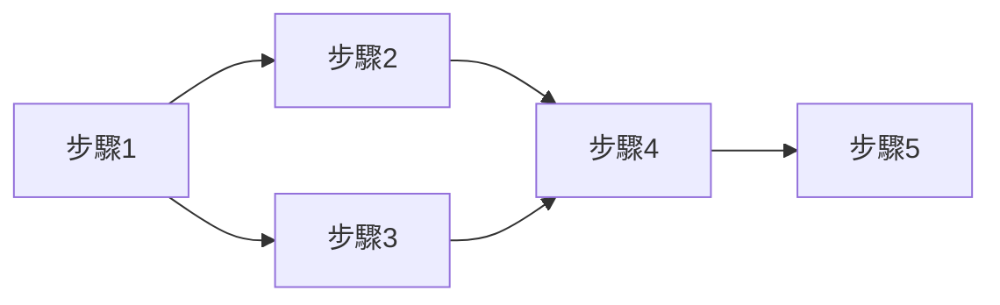

# Spring Batch高級
## 🍃多線程步驟
![[SpringBatch_09_高級_01_多線程步驟架構.png]]
- 多線程環境下，步驟需要設定為不可重啟，可參考：[[🍃SpringBatch_05_作業控制#🍃禁止重啟]]
- 多線程步驟是通過`TaskExecutor`(任務執行器)實現，約定每一個塊啟動一個線程獨立執行
- Spring Batch提供的`ItemReader`都是有狀態的，若對象維護狀態會被多個線程訪問，可能會有處程間狀態相互覆的問題，所以`ItemReader`需要設置`saveState(false)`，因此作業是不可以重啟的

```java
@Bean
public FlatFileItemReader t66_itemReader() {
	return new FlatFileItemReaderBuilder<>()
			.name("t66_itemReader")
			.saveState(false) // 設置防止狀態被覆蓋
			.resource(new ClassPathResource("T66_ReadFile.txt"))
			.delimited().delimiter("#")
			.names("id", "name", "age")
			.targetType(T49_User.class)
			.build();
}

@Bean
public Step step01_66() {
	return this.stepBuilderFactory.get("step_01")
			.<T49_User, T49_User>chunk(1)
			.reader(this.t66_itemReader())
			.writer(this.t66_itemWriter())
			.taskExecutor(new SimpleAsyncTaskExecutor()) // 任務執行器，以塊為單位開啟多線程處理
			.build();
}
```

## 🍃并行步驟
多個步驟同時執行


```java
@Bean
public Job job67() {
	// 并行步驟2
	Flow flow02 = new FlowBuilder<Flow>("t67_flow_02")
			.start(this.step02_67())
			.build();

	// 并行步驟3
	Flow flow03 = new FlowBuilder<Flow>("t67_flow_03")
			.start(this.step03_67())
			.split(new SimpleAsyncTaskExecutor()) // 啟動線程執行步驟
			.add(flow02) // 與并行步驟1、2同時啟動
			.build();

	return this.jobBuilderFactory.get("t67_job_01")
			.incrementer(new RunIdIncrementer())
			.start(this.step01_67())
			.next( // 將流包裝成步驟
					this.stepBuilderFactory.get("t67_flow")
							.flow(flow03)
							.build()
			)
			.next(this.step04_67())
			.build();
}
```

## 🍃分區步驟
![[SpringBatch_09_高級_02_分區步驟架構.png]]
- 分區步驟指的是將步驟區分為上下級
	- 上級(Master Step，主步驟)，負責管理多個從步驟
	- 下級(Work Step，從步驟)，具體執行讀、處理、寫邏輯
- 分區步驟主要用於大量數據的處理上，主步驟將數據划分成多個小數據集，交由多個從步驟執行，當所有從步驟完成處理，所有流程才算結束
- `MultiResourcePartitioner`，分區器，負責數據分區
	```java
	public interface Partitioner {
		// 返回Map Key，從步驟名稱
		// 返回Map Value，從步驟啟動需要的參數，如：分區元數據(起始位置、數據量)…
	    Map<String, ExecutionContext> partition(
		    int var1 // 將數據切成多少塊
		);
	}
	```
- `TaskExecutorPartitionHandler`，分區處理器，負責將任務指派給從步驟

### 大致流程
![[SpringBatch_09_高級_03_分區步驟大致流程.png]]

1. 作業(Job)啟動主步驟(Master Step)
2. 主步驟啟動初區處理器
	1. 分區器創建從步驟(Work Step)
	2. 指定要處理數據文件
	3. 處理數據文件邏輯
3. 所有從步驟開始執行
	1. Reader
	2. Processer
	3. Writer

### 建立測試資料
```txt
1#Mickey#233  
2#Molly#123  
3#Tai#111  
4#Anny#222  
5#June#234  
6#Test01#35  
7#Test02#746  
8#Test03#345  
9#Test04#456  
10#Test05#567
```

- T70_ReadFile_01.txt
- T70_ReadFile_02.txt
- T70_ReadFile_03.txt
- T70_ReadFile_04.txt
- T70_ReadFile_05.txt

### 建立分區器
1. 建立分區器，實現`Partitioner`
	```java
	// 分區器，指定從步驟名稱、配置從驟步執行時需要的上下文環境
	public class T71_Partitioner implements Partitioner {
	    /**
	     * @param fridSize 從步驟數量
	     * @return key，從步驟名稱；value，從步驟步執行時需要的上下文環境
	     */
	    @Override
	    public Map<String, ExecutionContext> partition(int fridSize) {
	        Map<String, ExecutionContext> contextMap = new HashMap<>();
	        for (int i = 1; i <= fridSize; i++) {
	            try {
	                ExecutionContext context = new ExecutionContext();
	                // 讀取的檔案名稱，分割的檔案由先前的步驟處理
	                // Spring Batch中單獨使用對象會報錯，但可以用url字符串格式，Spring會自動加載
	                Resource resource = new ClassPathResource(String.format("T70_ReadFile_%02d.txt", i));
	                context.putString("file", resource.getURL().toExternalForm());
	
	                contextMap.put(String.format("t70_part_%02d", i), context);
	            } catch (IOException e) {
	                throw new RuntimeException(e);
	            }
	        }
	        return contextMap;
	    }
	}
	```
2. 注入分區器
	```java
	// 分區器
	@Bean
	public T71_Partitioner t71_partitioner(){
		return new T71_Partitioner();
	}
	```

### 設定從步驟執行邏輯
```java
// 從步驟共用的讀操作組件
@Bean
@StepScope // 延遲加載
public FlatFileItemReader t70_itemReader(
		@Value("#{stepExecutionContext['file']}") Resource resource // 讀取的文件路徑，分區器會將此信息放至步驟上下文中
) {
	return new FlatFileItemReaderBuilder<>()
			.name("t70_itemReader")
			.resource(resource)
			.delimited().delimiter("#")
			.names("id", "name", "age")
			.targetType(T70_User.class)
			.build();
}

// 從步驟寫操作
@Bean
public ItemWriter t70_itemWriter() {
	return (list) -> list.forEach(System.out::println);
}

// 從步驟
@Bean
public Step stepWorker_70() {
	return this.stepBuilderFactory.get("step_worker")
			.<T70_User, T70_User>chunk(1)
			.reader(this.t70_itemReader(null))
			.writer(this.t70_itemWriter())
			.taskExecutor(new SimpleAsyncTaskExecutor()) // 任務執行器，以塊為單位開啟多線程處理
			.build();
}
```

### 設置分區處理器
```java
// 分區處理器
@Bean
public PartitionHandler t71_partitionHandler() throws Exception {
	TaskExecutorPartitionHandler handler = new TaskExecutorPartitionHandler();
	handler.setGridSize(5); // 設置從步驟數量
	handler.setTaskExecutor(new SimpleAsyncTaskExecutor()); // 開啟線程執行從步驟，一個從步驟是一個獨立的線程
	handler.setStep(this.stepWorker_70()); // 指定從步驟
	handler.afterPropertiesSet();
	return handler;
}
```

### 定義主步驟
```java
// 主步驟
@Bean
public Step stepMaster_70() throws Exception {
	return this.stepBuilderFactory.get("step_master")
			.partitioner(
					this.stepWorker_70().getName(), // 從步驟名稱
					this.t71_partitioner() // 分區器
			)
			.partitionHandler(this.t71_partitionHandler()) // 分區處理器
			.build();
}
```

### 定義作業
```java
@Bean
public Job job70() throws Exception {
	return this.jobBuilderFactory.get("t70_job_01") //
			.incrementer(new RunIdIncrementer()) //
			.start(this.stepMaster_70()) //
			.build();
}
```