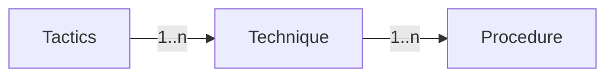

# 駭客實務入門_01_道德駭客概述
## 🗡資訊安全 Information Security
資訊安全為了保護組織的資訊，確保資訊在未經授權的情況下==不被變更、竊取及破壞==，避免敏感資訊遭變更破壞導致財務、品牌聲譽的損失

### 防守方資訊安全要件
資訊安全要件，Elements of Information Security

- Confidentiality(機密性)
	1. 確保存取的資訊是經授權的
	2. 機密性資訊傳遞和儲存時必須加密處理
- Integrity(完整性)
	1. 確保修改資訊時是經授權的
	2. 資訊傳送或儲存過程中，必需證明內容未遭到竄改或偽造
- Availability(可用性)
	1. 資訊在經授權情況下，隨時能夠傳輸、儲存、處理
	2. 受攻擊時，所使用的系統必須不能中斷服務，如：遭惡意程式、勒索軟體、分散式阻斷服務攻擊時還可正常使用系統
- Non-repudiation(不可否認性)
	1. 確保使用者在使用、修改、傳輸資訊時，無法否認是本人操作
	2. 使用數位簽章來確保不可否認性，如：自然人憑證
- Authentication(身分認證)
	1. 確保資訊傳輸、文件或資料的認證是唯一的使用者產生
	2. 如：帳號密碼、雙因子認證、iphone Touch ID 、自然人憑證，網站HTTPS所使用的憑證
- Authorization(授權)

### 攻擊方資訊安全要件
**Attacks = Motive + Method + Vulnerability**

- Motive(動機)：攻擊方執行攻擊行為的動機
- Method(方法)：攻擊方利用各種工具，攻擊技術攻擊使用者電腦
- Vulnerability(弱點)：攻擊方利用電腦中的弱點或系統安全策略的不足

## 🗡資訊安全攻擊類型
### 被動攻擊 Passive Attacks
攻擊者不會直接接觸被攻擊目標，而是使用==側錄網路流量==的方式來蒐集敏感資訊，系統管理者將難以查覺

- 足跡探測(FootPrinting)
- 監聽和竊聽(Sniffing and eavesdropping)
- 網路流量分析(Network traffic analysis)

### 主動攻擊 Active Attacks
攻擊者直接攻擊目標主機服務或是透過網路找到目標主機弱點攻擊，相較被動攻擊較容易被防禦機制偵測到

- 分散式阻斷攻擊、攻擊防火牆和IDS、繞過保護機制
- 惡意程式攻擊(蠕蟲、後門、勒索)
- 密碼攻擊、金鑰洩漏、身分認證劫持
- 任意程式碼執行、權限提升、利用系統或應用程式
- DNS汙染、 ARP汙染、中間人攻擊、重放攻擊、欺騙攻擊
- 加密破解、資料庫注入、跨網站指令碼攻擊、目錄遍歷

### 近距離攻擊 Close-in-Attacks
攻擊者在實體上靠近目標，如：偷看密碼(shoulder surfing)、USB散播惡意程式…等

### 內部攻擊 Insider Attacks
攻擊者在組織或企業內本身是受信任的，攻擊者可以用本身的權限存取資源繞過安全規則存取敏感資訊，系統管理者難以弄清楚內部攻擊來源

- 竊聽(Eavesdropping)
- 竊取實體設備(Theft of physical devices)
- 社交工程(Social engineering)
- 粉碎資料重組拼接 (Data theft and spoliation)
- 利用儲存媒體夾帶機密資料(pod slurping)
- 密碼側錄(keyloggers)
- 後門(backdoors)
- 惡意程式(malware)

### 散佈攻擊 Distribution Attacks
攻擊者針對尚未發布的軟體或硬體植入後門，再藉由相關軟體發行的機制讓使用者安裝軟體，進而獲得未經授權的存取權限

- SolarWinds供應鏈攻擊事件，參考：[臺灣研究人員解析SolarWinds供應鏈攻擊事件](https://www.ithome.com.tw/news/143240)

## 🗡資訊戰 Information warfare
### 中繼站爭奪戰 Command and Control
- 中繼站代表已經遭受攻擊者控制的主機，相當於攻擊者所擁有的資源
- 攻擊者可以藉由操控這些主機發動攻擊
- 中繼站只要到達一定數量，除非停止服務，否則基本上攻擊就無法被阻止

### 情報戰 Intelligence-based
- 基於蒐集情報，分析情報後進而主導戰場

### 電子戰 Electronic
- 利用無線通信的方式破壞實體或竊取無線通信內容，常見於戰爭

### 心理戰 Psychological
- 心理戰是使用各種技術，例如宣傳有關恐怖事件的文宣，使對方士氣低落，從而在戰術中取得成功

### 駭客戰 Hacker
- 駭客戰的目的可能與系統關閉，資訊錯誤，資訊盜用，服務盜用，系統監視，錯誤消息傳遞以及對敏感資料的存取。駭客通常使用病毒、邏輯炸彈、惡意程式執行這些攻擊

### 經濟戰 Economic
- 經濟戰會影響依賴資訊的組織和企業或國家的經濟發展
- 可參考：[歐美祭出核彈級的金融制裁，俄羅斯被踢出SWIFT會如何？](https://money.udn.com/money/story/122698/6132775 "https://money.udn.com/money/story/122698/6132775")

### 網路戰 Cyberwarfare
- 網路戰是所有資訊戰中最廣泛的戰爭。其中包括資訊恐怖主義及 語義攻擊

### 進攻性和防禦性資訊戰 Offensive & Defensive
- 進攻方，紅隊
- 防守方，藍隊
- 通過進攻方不斷的攻擊來加強防守方的防禦手段

## 🗡網路狙殺鍊 Cyber Kill Chain
- 網路狙殺練是一種==以攻擊者的視角==來看如何攻擊目標的SOP
- 網路狙殺鍊可幫助組織或企業了解各種可能的威脅，在攻擊的每個階段以及防禦此類攻擊的必要對策， 以便可以實施不同級別的安全控制，以保護組織的IT基礎架構

### 偵察 Reconnaissance
攻擊者在網路上蒐集的公開可用的資訊、網路資訊、系統資訊以及目標的組織或企業資訊，相關章節-->[[🗡駭客實務入門_02_網路偵察]]

- 通過蒐索或網路收集有關目標組織的資訊
- 通過社交工程
- 對各種線上活動和公開資訊進行分析
- 從社交媒體和網頁服務收集資訊
- 獲取有關網站的資訊
- 監視和分析目標組織或企業的網站
- 執行Whois、DNS和網路足跡分析
- 執行掃描以識別開放的埠位和服務

### 武器化 Weaponization
根據分析過程中發現的弱點，攻擊者使用弱點，撰寫客製化的後門或量身定制的惡意程式，將其發送給受害者

- 根據分析結果確定合適惡意軟體
- 量身定制的惡意程式並搭配可攻擊之弱點
- 製作網路釣魚郵件
- 利用弱點、工具包、殭屍網路

### 傳輸 Delivery
將惡意程式傳送給受害者；傳輸階段是衡量目標組織的防禦策略的是否有效，也就是是否能夠否阻止了攻擊者的嘗試入侵

- 發送釣魚郵件
- 傳遞包含惡意程式的USB
- 在已被入侵的網站上投放惡意程式執行攻擊
- 利用各種駭客工具嘗試入侵目標組織或企業的伺服器、系統或應用程式

### 利用 Exploitation
受害者觸發惡意程式，惡意程式將直接利用目標系統上的伺服器、作業系統中的弱點來取得非授權的權限

- 利用程式或硬體弱點來遠端存取目標系統

### 安裝 Installation
攻擊者會在目標系統上下載並安裝更多惡意程式，以長時間保持對目標網路的存取權或入侵其他系統，並試圖規避防火牆或防毒軟體的偵測，例如編碼或加密，如Base64、XOR及RSA…等

- 下載和安裝後門之類的惡意程式
- 獲得對目標系統的遠端存取權
- 利用各種方法保持後門隱藏和運用
- 保持對目標系統的存取

### 命令與控制 Command and Control
攻擊者創建命令和控制通道，從而建立與受害者與攻擊者所擁有的伺服器通信，並以加密通道方式來隱藏傳輸的數據。利用這個通道，攻擊者在目標系統或網路上執行遠端利用，並隱藏自身實際的IP

- 在受害者的系統與攻擊者控制的伺服器之間，建立雙向通信通道
- 利用電子郵件和DNS等通道來規避偵測
- 利用特權提升技術
- 使用加密之類的技術隱藏任何危害的證據

### 行動和目的 Actions on Objectives
- 攻擊者從遠端控制受害者的系統，最後完成他們的預期目標
- 破壞服務或網路，或破壞目標的可用性、獲得存取其網路並損害更多系統的能力
- 攻擊者可能以此作為發起其他攻擊的起點

## 🗡戰術、技術、程序 TTPs
- Tactics ,Techniques and Procedures(TTPs)，指戰術、技術和程序，是MITRE提出用以描述威脅行動者的攻擊模式或特徵，以達到識別攻擊者行為
- TTPs是==以防守方的視角==區分攻擊的類型和駭客的攻擊習慣，甚至可以匹配駭客組織
- TTPs有助於分析威脅和大略分析攻擊者，並且可以進一步用 於增強組織或企業的基礎架構安全性
- 可參考：
	- [MITRE ATT&CK Navigator](https://mitre-attack.github.io/attack-navigator/)
	- [MITRE ATT&CK 資安框架淺談](https://medium.com/archerworks/mitre-att-ck-%E8%B3%87%E5%AE%89%E6%A1%86%E6%9E%B6%E6%B7%BA%E8%AB%87-ec733cc5d3b9)

### 戰術 Tactics
- 戰術(Tactics)：攻擊者在不同攻擊階段的階段性目標，如：權限提升，橫向移動，維持系統存取權，電子郵件蒐集…等
- 通常APT(進階持續性威脅)組織會發展出一組常見的戰術但 在某些情況下，他們會適應不同的情況並改變他們執行攻擊的方式
- 可根據攻擊者使用的戰術歸納出攻擊來源

### 技術 Techniques
- 技術(Techniques)：用於描述網路攻擊如何進行

### 程序 Procedures
- 程序(Procedures)：將網路攻擊詳細拆解成每一步的動作，最能夠分析出攻擊者來源
- 在攻擊生命週期的不同步驟中，動作數量通常會有所不同，具體取決於根據程序和攻擊者的目標

### 攻擊者行為識別 Adeversary Behavioral Identification
幫助資訊安全人員計劃網路安全基礎架構並調整一系列安全程序，以防各種網路攻擊

- 內網偵查
- 使用 Powershell
- 未指定的代理伺服器
- 使用指令介面
- HTTP User Agent
- Command & Control Server (C2)
- DNS 通道
- 網頁後門
- 資料分割

## 🗡攻擊者行為識別
攻擊者行為識別(Adeversary Behavioral Identification)：幫助資訊安全人員計劃網路安全基礎架構並調整一系列安全程序，以防各種網路攻擊

- 內網偵查
- 使用 Powershell
- 未指定的代理伺服器
- 使用指令介面
- HTTP User Agent
- Command & Control Server (C2)
- DNS通道
- 網頁後門
- 資料分割

## 🗡入侵指標
Indicators of Compromise(入侵指標，IoCs)：入侵指標是指任何有關惡意攻擊的行為或標準，包含：

1. 電子郵件
	- 寄件者通常為匿名註冊或免費郵件
	- 通常都會夾帶惡意檔案
2. 網路流量入侵指標
	- 連線到惡意的域名、IP或URL
	- 不正常的DNS請求
	- DDOS
	- 流量來自不常出現的地理位置
3. 主機入侵指標
	- 發現惡意檔名
	- 檔案雜湊(Hash)與已知惡意程式相同
	- 註冊表鍵值：觸發惡意程式的條件，保證惡意程式不會因為系統中斷停止運作
	- DLL
	- mutex
4. 惡意行為入侵指標
	- 文件執行powershell script
	- 程式碼注入

## 🗡駭客 Hacker
- 在資訊安全領域的駭客攻擊，指利用系統弱點破壞安全控制以未經授權或對系統的資源存取
- 駭客技術
	- 撰寫病毒和蠕蟲
	- 執行拒絕服務(DoS)攻擊
	- 使用特洛伊木馬或後門
	- 創建殭屍網路
	- 封包側錄
	- 網路釣魚
	- 密碼破解

### 駭客分類
- 黑帽駭客(Black Hat)：黑帽駭客的技能用於非法或惡意目的
- 白帽駭客(White Hat)：白帽駭客或滲透測試人員是利用駭客技術檢測可能有問題的系統，防止惡意攻擊的發生
- 灰帽駭客(Gray Hat)：同時為黑帽駭客、白帽駭客
- 自殺式駭客(Suicide Hacker)：旨在破壞基礎設施，他們並且不擔心面臨監禁條款或任何其他形式的懲罰
- 腳本小子(Script Kiddies)：技能不熟練的駭客，他們通過運用別的駭客的腳本來破壞系統。他們通常專注於數量而不是攻擊質量
- 網路恐怖份子(Cyber Terrorists)：網路恐怖份子是具有廣泛技能，具有積極性的人通過宗教或政治信仰引起對網路大規模破壞
- 國家資助的駭客(State-Sponsored Hacker)：國家支持的駭客是受僱於政府，這些駭客從其他政府的資訊系統中獲取最高機密資訊
- 駭客行為主義者(Hacktivist)：駭客行為主義是指駭客入侵政 府或公司系統作為抗議行為

### 攻擊階段 Hacking stage
- 偵察
- 掃描
- 獲得存取權限
- 維持存取
- 清理軌跡

### 道德駭客 Ethical Hacking
- 在執行委託的滲透測試或安全評估中必須確保測試過程中擁有高效性、道德性、組織性，並與客戶討論測試期間需要解決的需求
- 道德駭客常見大概流程
	1. 與客戶準備並簽署NDA(Non-disclosure agreement)保密協議文件
	2. 準備一個道德駭客團隊並排定測試時間、測試范圍
	3. 進行測試
	4. 分析測試結果並準備報告
	5. 向客戶報告結果和修補建議
- 具備的技能
	1. 深入了解必須技術和相關軟硬體
	2. 精通一項資訊技術領域的專家
	3. 了解資安領域知識及相關問題
	4. 具有如何發動複雜攻擊的高級技術知識能力
	5. 快速學習和適應新技術的能力
	6. 良好的職業道德、解決問題及溝通能力
	7. 對當地標準和法律的認識

## 🗡資訊安全控制 Information Security Control
資訊保障(Information Assurance,IA)：對資訊在使用的資訊內容(使用、處理、存儲、傳輸)的完整性、可用性、 機密性和真實性的保障

### 深度防禦 Defense-in-depth
深度防禦(Defense-in-depth)：資安專業人員使用多種防護設備分別對各個資訊系統防護，導致攻擊者進入下一層時間拉長，有助於防禦方進行防禦

### 風險管理 Risk Management
- 風險是指對不利因素和不確定性或潛在損害的預期程度，在某先條件下可能會導致系統和資被破壞
- `RISK(風險) = Threats(攻擊者威脅) x Vulnerabilities(弱點) x Impact(影響)`
- `RISK(風險) = Threats(攻擊者威脅) X Vulnerabilities(弱點) X Asset Value (資產價值)`

#### 風險等級 Risk Level
| Risk Level(風險等級) | Action(行動)                                             |
| -------------------- | -------------------------------------------------------- |
| 極高/高風險          | 立即採取措施、對抗風險、確定並實施控制措施以減少風險降低 |
| 中風險               | 無需緊急措施、盡快實施控制、將風險 降低到合理的低水平    |
| 低風險               | 採取預防措施以減輕風險的影響                             | 

#### 風險矩陣 Risk Matrix
|            | 可能性     | 後果 微不足道 | 後果 次要 | 後果 中等 | 後果 重大 | 後果 嚴重 |
| ---------- | ---------- | ----------------- | ------------- | ------------- | ------------- | ------------- |
| 81% ~ 100% | 極高可能性 | 低                | 中            | 高            | 極高          | 極高          |
| 61% ~ 80%  | 高可能性   | 低                | 中            | 高            | 高            | 極高          |
| 41% ~ 60%  | 中度可能性 | 低                | 中            | 中            | 高            | 高            |
| 21% ~ 40%  | 低可能性   | 低                | 低            | 中            | 中            | 高            |
| 1% ~ 20%   | 極低可能性 | 低                | 低            | 中            | 中            | 中            |

#### 網路威脅情報 Cyber threat intelligence
收集網絡攻擊的趨勢、情報，根據系統需要長期的網路活動情報或短期的回應，還是高層的管理者或基層的執行者，所需要的網路威脅情報類型都會不同

#### 網路威脅建模 Threat modeling
在取得網路威脅情報前，需要熟悉內部系統

資産盤點
	↓
分析資産
	↓
拆解更詳細的資産架構
	↓
威脅識別
	↓
漏洞識別

### 事件管理 Incident Management
事件管理(IM)的目的是在資安事件發生後，令系統儘快地恢復到正常服務營運水平，且儘可能地減小事故對商業運作的影響，以此來保證達到服務質量的最高水平

### 事件回應 Incident Response
事件回應(IR)指組織運用多種方式回應資安漏洞或資料外洩、資安事件的相關作業流程，可參考：[網路安全事件應變Step by Step - BSI](https://www.google.com.tw/url?sa=t&rct=j&q=&esrc=s&source=web&cd=&ved=2ahUKEwiL8eXNzqz7AhXT3GEKHZZHCY0QFnoECAsQAQ&url=https%3A%2F%2Fwww.bsigroup.com%2FLocalFiles%2Fzh-tw%2Fe-news%2FNo164%2FCyber-Incident-Response-Step-by-Step.pdf&usg=AOvVaw1USwuqSfVwoWYQmNYCKwbn)

1. 準備
2. log、事件記錄、分配
3. 資安事件觸發
4. 通知各部門
5. 抑制可疑入侵點，防止影響擴大
6. 對受損主機進行數位取證
7. 根絕入侵原因
8. 發布事件處理狀況，書面報告
	1. 事件文件
	2. 事件評定
	3. 重新檢視和擬訂安全策略
	4. 結束調查
	5. 事件對外發布

### 使用AI快速反應
可以通過AI來快速反應資安事件，並做出處理

- 監督式學習(Supervised learning)：標記過的資料就好比標準答案，電腦在學習的過程透過對比誤差，一邊修正去達到更精準的預測，這樣的方式讓監督式學習有準確率高的優點，但是事前需耗費大量人工作業，在面對未知領域時，幾乎是完全無法運作
- 非監督式學習 (Unsupervised Learning)：不需要事先以人力處理標籤，機器面對資料時，做的處理是依照關聯性去歸類、找出潛在規則、形成集群，但不對資訊有正確或不正確的判別

## 🗡資訊安全法律和標準 Information security laws and standards
- 國際標準組織 ISO 27001:2013
	- 是一套國際通用的資訊安全管理工具和制度，以呼應全球對於資訊安全風險之因應措施，以及控制並降低資訊安全事件所帶來的威脅和衝擊
	- 因此，ISO/IEC27001：2013也提供所有類型的組織，包含商業企業、政府機構和非營利組織，都能建立資訊安全管理系統
- 美國病歷與病人醫療資訊的管理方式 (Health Insurance Portability and Accountability Act,HIPPA)
	- 主要是針對個人醫療的資料安全、隱私以及資料交換定出醫療資訊管理的標 準，明定關於醫療保健行業所必需具備的資訊安全內容。
- 薩班斯-奧克斯利法案 (Sarbanes-Oxley Act，SOX)
	- 是美國國會根據安隆有限公司及世界通訊公司等財務欺詐事件破產暴露出來的公司和證券監管問題所立的監管法規
- 數位千禧年著作權法 (Digital Millennium Copyright Act,DMCA)
	- 它是一個美國著作權法律，它實現了兩個世界智慧財產權組織（WIPO）在1996年通過的條約。它以刑事犯罪立法的形式禁止了受著作權保護（通常是受「數位內容權利管理，DRM技術控制」）的技術、裝置或服務的生產與傳播，以及繞過DRM本身的行為。此外，DMCA還加大了對於網際網路侵權的處罰
- 台灣電腦犯罪法律
	- **無故入侵電腦罪(刑法三百五十八)**：因電腦系統遭惡意入侵後，系統管理者須耗費大量之時間人力檢查才能確保電腦系統之安全 
	- **無故變更電磁記錄罪(刑法三百五十八)**：如果電腦中的重要資料遭到取得、刪除 或變更，將導致電腦使用人受有重大損害
	- **干擾電腦系統及相關設備罪(刑法三百六十)**：為規範駭客攻擊、癱瘓網路，破壞生活秩序之行為
	- **加重處罰規定(刑法三百六十一)**：危及國家安全之虞
	- **製作專供電腦犯罪之程式罪(刑法三百六十二)**：對電腦系統安全性危害甚鉅，往往造成重大之財產損失

