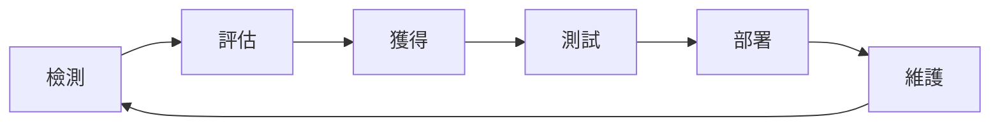

# 駭客實務入門_08_網頁伺服器入侵
## 🗡網頁伺服器概述 Web Server
- 網頁伺服器是用於託管服務的平台
- 這些伺服器幾乎都在單獨的網頁伺服器上或硬體上
- 它通過超文本傳輸協議(HTTP)或是超文本傳輸安全協定(HTTPS)傳遞內容
- 主要是各種程式語言構建而成，像是C#、Java 、 Python Flask等相關的程式語言

### 網頁三層架構
Model-View-Controller(MVC)
![[駭客實務入門_08_網頁伺服器入侵_01_網頁三層架構.png]]

### 網頁伺服器的組成
- 網頁根目錄
	- IIS 和 Apache 預設網頁網址根目錄，[Http://xxx.xxx.xxx.xxx/]()
	- 預設網頁伺服器實體目錄
		1. IIS 預設伺服器根目錄，C:/inetpub/wwwroot/
		2. Apache 在Linux下預設伺服器根目錄，/var/www/html/
- 虛擬目錄
	- IIS虛擬目錄，可參考：[IIS站台建立FTP虛擬目錄](https://dotblogs.com.tw/chichiBlog/2017/11/30/094751)、[Http 請求 Asp.net IIS伺服器架構](https://ithelp.ithome.com.tw/articles/10214877)
		![[駭客實務入門_08_網頁伺服器入侵_02_IIS運作方式.png]]
	- Apache虛擬目錄
	```
	Alias /別名 "實體路徑"
	<Directory "實體路徑">
		AllowOverride None
		Require all granted
	</Directory>
	```

### 網頁伺服器架構
- 開源網頁伺服器架構，以下以Apache + Tomcat為例
	![[駭客實務入門_08_網頁伺服器入侵_03_開源網頁伺服器架構.png]]
- Nginx Reverse Proxy架構
	![[駭客實務入門_08_網頁伺服器入侵_04_Nginx Reverse Proxy架構.png]]

## 🗡入侵方式
- 檔案和目錄權限配置不當
- 啟用不必要的服務
- 預設帳號
- 不必要的檔案
- 錯誤的設定
- 網頁平台本身有弱點
- 除錯模式開啟導致資訊洩漏
- HTTP 請求換行攻擊(CRLF)，可參考：[新手的Web系列CRLF 0x2](https://ithelp.ithome.com.tw/articles/10252589?sc=rss.iron)
	1. CR (Enter 鍵) URL `HEX:%0d`
	2. LF (換行) URL `HEX:%0a`
- 網頁快取攻擊，可參考：[[🗡駭客實務入門_07_網路監聽#DNS中毒 DNS Poisoning]]
- 伺服器請求偽造(Server-Side Request Forgery，SSRF)，可參考：[網站安全🔒 伺服器端請求偽造 SSRF 攻擊 — 「項莊舞劍，意在沛公」](https://medium.com/%E7%A8%8B%E5%BC%8F%E7%8C%BF%E5%90%83%E9%A6%99%E8%95%89/%E7%B6%B2%E7%AB%99%E5%AE%89%E5%85%A8-%E4%BC%BA%E6%9C%8D%E5%99%A8%E8%AB%8B%E6%B1%82%E5%81%BD%E9%80%A0-ssrf-%E6%94%BB%E6%93%8A-%E9%A0%85%E8%8E%8A%E8%88%9E%E5%8A%8D-%E6%84%8F%E5%9C%A8%E6%B2%9B%E5%85%AC-7a5524926362)
	![[駭客實務入門_08_網頁伺服器入侵_05_伺服器請求偽造.png]]
- 平台解析不一致，可參考：[BlackHat 2018 | 看Orange Tsai如何利用四個Bug實現亞馬遜協同平臺的RCE漏洞](https://www.xuehua.us/a/5eb5291a86ec4d63e68eeaae?lang=zh-hk)
	![[駭客實務入門_08_網頁伺服器入侵_06_平台解析不一致.png]]

## 🗡入侵工具
### owasp-zap
- 工具官網：[owasp-zap](https://www.zaproxy.org/)
- 源始碼庫：[owasp-zap - github](https://github.com/zaproxy/zaproxy)
- 參考教程：[網頁安全性測試：OWASP ZAP使用入門](https://www.tpisoftware.com/tpu/articleDetails/2161)

![[駭客實務入門_08_網頁伺服器入侵_07_owasp-zap.png]]

### Openvas
- 工具官網：[Openvas](https://www.openvas.org/)
- 參考教程：[善用開源工具OpenVAS快速做系統弱點掃描](https://www.uuu.com.tw/Public/content/article/20/20200203.htm)

![[駭客實務入門_08_網頁伺服器入侵_08_Openvas.png]]

### Burpsuite Pro
- 工具官網：[Burpsuite Pro](https://portswigger.net/burp/pro)
- 參考教程：[Web滲透測試 – Burp Suite 完整教學系列](https://hackercat.org/burp-suite-tutorial/web-pentesting-burp-suite-total-tutorial)

![[駭客實務入門_08_網頁伺服器入侵_09_Burpsuite.png]]

### Acunetix
- 工具官網：[Acunetix](https://www.acunetix.com/)

![[駭客實務入門_08_網頁伺服器入侵_10_Acunetix.png]]

### Nessus
- 工具官網：[Nessus](https://zh-tw.tenable.com/products/nessus)
- 參考教程：
	1. [系統弱點掃描工具-Tenable Nessus(上)](https://ithelp.ithome.com.tw/articles/10268209)
	2. [系統弱點掃描工具-Tenable Nessus(中)](https://ithelp.ithome.com.tw/articles/10268957)
	3. [系統弱點掃描工具-Tenable Nessus(下)](https://ithelp.ithome.com.tw/articles/10269733)

![[駭客實務入門_08_網頁伺服器入侵_11_Nessus.png]]

### Nikto
- 根據wiki的資料，`nikto`是一個GPL開源的網頁伺服器掃描器，主要功能就是掃描目標網頁伺服器是否有以下問題：
	1. 錯誤的配置
	2. 預設文件和腳本
	3. 不安全的文件和腳本
	4. 過時軟體
- 工具官網：[Nikto](https://cirt.net/Nikto2)
- Kali官網說明文件：[Nikto - Kali Tools](https://www.kali.org/tools/nikto/)
- 源始碼庫：[Nikto - github](https://github.com/sullo/nikto)
- 參考教程：[Web漏洞扫描神器Nikto使用指南](https://zhuanlan.zhihu.com/p/124246499)

## 🗡防禦對策

