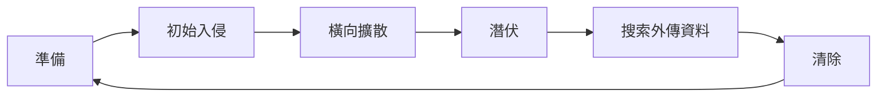
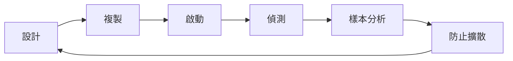

# 駭客實務入門_13_惡意程式威脅
## 🗡惡意軟體 Malware
- 惡意軟體是指會以最高或最低的權限進行破壞或竊取資料的軟體
- 在實際情況下，惡意軟體並沒有具體的分類，因為都為駭客依所需的功能開發
- 惡意軟體的種類包括：蠕蟲，木馬、rookit、後門、殭屍網路、勒索、間諜、廣告、恐嚇、流氓、加密、鍵盤側錄等軟體，這些軟體可能會刪除檔案、降低電腦速度、偷取個人資料、寄送垃圾郵件、詐騙等行為

### 傳輸媒介
1. 即時通訊軟體：攻擊者可以使用這些通訊平台竊取使用者的個人資訊、帳號密碼、甚至是個人的軌跡，可參考：[iOS (iPhone) iMessage 漏洞：沒有點擊也會被入侵](https://blog.longwin.com.tw/2021/09/news-iphone-ios-imessage-security-crack-hack-2021/)
2. 移動式儲存媒體：就是我們生活中使用的CD/DVD、USB、記憶卡等可插拔的設備，其中以USB可以輕鬆讀寫，攜帶方便等特性，使攻擊者使用USB成為惡意程式的傳播媒介，讓惡意程式到處擴散
3. 瀏覽器的弱點，如：[水坑攻擊 water-fall](https://zh.wikipedia.org/zh-tw/%E6%B0%B4%E5%9D%91%E6%94%BB%E5%87%BB)
4. 未修補弱點的機器或軟體：企業中未修補弱點的機器或軟體，將成為攻擊者首要的目標，這些目標也是比較明確的攻擊標的，攻擊者可以用已知的弱點，利用程式來達到破壞或是竊取資料的目的
5. 不安全的免費軟體：很有可被攻擊者安裝並騙取使用者使用進而達到攻擊使用者的目的
6. 電子郵件附件：透過社交工程寄送給使用者，使用者點擊附件後將觸發惡意程式

### 惡意程式躲避防毒軟體功能分類
- 加密(cypter)：透過加密的方式，攻擊者可以將惡意程式碼，透過特定的加密演算法加密以繞過防毒軟體檢查。如：RC4、xor等
- 下載(Downloader)：透過下載的方式，攻擊者在使用者電腦下載檔案(下載更多功能)，並且安裝惡意程式取得第一次權限
- 投放(Dropper)：在已安裝的惡意程式中通常都會有其他的功能，但這些功能是指惡意程式安裝完畢後才會開始使用，有的功能還會在調用功能的期間解密，用完後再加密，植入第二次後門，以規避防毒軟體偵測，主要用於較為敏感的程式碼片斷
- 利用(Exploit)：在取得第一次權限時，惡意程式會將系統相關資訊回傳至中繼站，讓攻擊者判斷該使用哪種類型的弱點取得更高的權限
- 注入(Injector)：在取得第一次權限時，根據惡意程式回傳的系統資訊，攻擊者會針對弱點的程式，進行惡意程式碼注入，進行潛伏，以防被移除或被防毒軟體偵測
- 混淆(obfuscator)：靜態防禦之一，混淆是一種讓正常的程式碼語法無法被正常識別的一種方法
- 加殼(packer)：靜態防禦之一，一般而言，殼會在軟體被載入後先執行，來對原本的程式碼解密或還原，解殼後才會進入到原本程式真正要開始執行的地方，==加殼的目的原本是為了讓程式本身不被輕易破解==，但現在防毒軟體偵測方式日新月異，普遍攻擊者都會希望在防毒軟體靜態掃描時不被偵測，所以攻擊者會用加殼來規避偵測

## 🗡進階持續性威脅 APT
- 進階持續性威脅(Advanced Persistent Threat，APT)，攻擊者從單一攻擊者變成一個攻擊組織，攻擊的目標變成特 定目標並擬定針對性的攻擊策略
- 一旦組織第一次被攻擊成功，潛伏期甚至會超過一年才被發現，這些組織的目的==通常不是破壞==，而是全方位掌握目標的資訊來達到==竊取企業的或組織的機密文件、政策或戰略、使用者認證、員工個人資訊、控制使用系統的權限==

### 組成要件
- 目標(Objectives)：APT 組織主要目的是==透過非法權限是獲取企業或組織的敏感資訊==，不會直接破壞系統
- 時限(Timeliness)：時限是指從攻擊者評估弱點可以利用到攻擊成功的時間
- 資源(Resources)：APT組織攻擊特定目標，通常需要大量的知識、工具、技術來支援攻擊行動，通常攻擊中都會有很多複雜的攻擊技術，其中包括以企業網路中已知的弱點或是APT組織所開發的未知弱點(Zero-Day)
- 規避風險(Risk Tolerance)：APT組織在攻擊目標時，會針對目標的網路進行偵查，透過第一次入侵時的偵查的資訊判斷如何規避目標網路上的其他的偵測設備，降低被偵測的機率
- 技巧與方法(Skills and Methods)：APT組織透過收集的公開資訊擬定特定的釣魚郵件，也就是魚叉式釣魚郵件(Spear phishing)來提高釣魚郵件被點擊，並==配合其他攻擊技巧如C2系統==以達到隱匿性及維持權限的目的
- 行動(Actions)：APT組織會針對目標擬定不一樣的策略來增加攻擊的成功率，這些不同的策略最後的目標都是要達到長期潛伏在目標網路裡並持續偷取資料

### 生命周期
在整個過程中，不同的APT組織會有不同的攻擊模式或特徵，以達到識別攻擊者行為，可參考：[[🗡駭客實務入門_01_道德駭客概述#🗡戰術、技術、程序 TTPs]]、[att&ck navigator](https://mitre-attack.github.io/attack-navigator/)



1. 準備(Preparation)
	- 目標選定
	- 目標研究
	- 打造工具
	- 測試偵測率
	- 尋找組員
2. 初始入侵(Initial Intrusion)
	- 開發惡意程式
	- 建立第一次對外連線基礎程式C2
3. 橫向擴散(Expansion)
	- 權限擴張
	- 獲得更多存取權限
4. 潛伏(Persistence)
	- 持續存取
5. 搜索外傳資料(Search And Exfiltration)
	- 搜索機敏資料並向外傳轉至C2
6. 清除(Clean Up)
	- 操作痕跡清理
	- 保持不被偵測
	- 勤索軟體

## 🗡木馬 Trojan Horse
- 在電腦領域中指的是一種==後門程式==，這種後門會透過通過傳播或者騙取目標執行該程式，等到指定的時間，木馬才會被真正啟動，以規避防毒軟體偵測
- 木馬的常見的目的有刪除或取代系統中重要的檔案，螢幕截圖、用受害端的電腦寄信、下載其他惡意程式、關閉防火牆、防毒軟體、修改代理伺服器位置、偷取敏感資訊，操控受害者主機

### njRAT
- njRAT也稱Bladabindi，它是最早期的木馬程式，具有遠端存取功能、檔案管理功能、蒐集資訊、上傳下載，也可以拿來當作C2來指揮殭屍網路，但無法更改系統資訊，可參考：[惡意程式-實作njRAT](https://ithelp.ithome.com.tw/articles/10192466?sc=iThelpR)
- 源始碼庫：[njRAT - github](https://github.com/TheC0mpany/NjRat-0.7D-Green-Edition-by-im523)

### Poison Ivy
Poison Ivy作者是Shapeless，據傳現在在美國FBI工作，他開發的最後一個版本是2007年的Poison Ivy 2.3.2，它可以和系統命令進行交互

### Necurs
Necurs犯罪模式主要是==透過垃圾郵件感染受駭者電腦==後，將其轉為殭屍網路，亦將殭屍網路租給犯罪團體散布勒索軟體、遠端存取木馬或可竊取機密資訊的惡意程式等

### Rootkit Sirefef
- 攻擊者為了取得系統管理員級的權限ROOT/Administrator為了清除被系統記錄的入侵痕跡，會重新組譯一些軟體工具，術語稱為kit
- Sirefef木馬家族Rootkit元件，==此木馬用自身變數名稱自我複製.dll檔案到Windows的系統資料夾中（system32）==。此外，會修改其他幾個系統檔來掩飾Sirefef木馬病毒，目的是在網頁瀏覽器內操控修改搜尋引擎結果，引導用戶點擊修改過的結果，獲取點擊該網址的推廣費用
- 可參考：[Rootkit - microsoft365](https://learn.microsoft.com/zh-tw/microsoft-365/security/intelligence/rootkits-malware?view=o365-worldwide)

### Emotet
- Emotet 是透過內含惡意 Word、Excel 文件或下載連結的垃圾郵件散播。一旦開啟附件，會跳出提示使用者「==啟用內容==」以便讓巨集運行的畫面，事實上它會偷偷安裝Emotet木馬程式
- 可參考：
	- [2022年2月17日，惡意軟體Emotet威脅升溫、美國關鍵基礎設施成勒索軟體BlackByte的受害者](https://www.ithome.com.tw/news/149414)
	- [「COVID-19」Emotet社交工程攻擊概述與防範建議](https://www.twcert.org.tw/newepaper/cp-64-5439-dad7c-3.html)

### Glitch
該木馬會利用貓咪圖像的遊戲方式來騙取使用者執行，但實際上是將藏在圖片中的惡意程式碼解碼並執行，並偷取使用者的信用卡資料

<iframe width="560" height="315" src="https://www.youtube.com/embed/luHkC_gNhTY" title="YouTube video player" frameborder="0" allow="accelerometer; autoplay; clipboard-write; encrypted-media; gyroscope; picture-in-picture" allowfullscreen></iframe>

### Zeus
Zeus是對金融系統威脅最大的殭屍網路之一，攻擊者藉助殭屍程序竊取賬戶登錄信息和信用卡號碼。 Zbot往往通過垃圾郵件來傳播，中毒的電腦會下載一個惡意程式執行並控制網路銀行，偷取敏感資訊

### Mirai
從物聯網設備開始興起時，攻擊者就開始入侵網路攝影機、路由器等有嵌入Linux作業系統的物聯網設備，作為殭屍網路的一員，其中Mirai針對物聯網設備進行預設帳號密碼嘗試連線登入，進而控制物聯網設備使其成為殭屍網路的其中一員

### 與病毒和蠕蟲的差異
| 惡意程式 | 行為                                 |
| -------- | ------------------------------------ |
| Trojan   | 觸發條件啟動程式，不會感漸其他電腦   |
| Virus    | 感染後，經過特定條件會去感染其他電腦 |
| Worms    | 感染後，自動去攻擊其他系統           |

## 🗡病毒和蠕蟲 Viruses And Worms
- 病毒和蠕蟲的功能類似，其主要的功能都是以破壞、偷取資料為主
- 病毒需要人為去散播或觸發
- 蠕蟲只需要一經投放就會開始自動尋找可以利用的目標進行攻擊並自我複製，達到快速傳播的目的。可參考：[蠕蟲 - microsoft365](https://learn.microsoft.com/zh-tw/microsoft-365/security/intelligence/worms-malware?view=o365-worldwide)

### 傳播管道
1. 下載
2. 電子郵件附件
3. 盜版軟體
4. 不安全的安裝設定
5. 軟體更新
6. ==瀏覽器弱點==
7. 彈跳視窗
8. 移動式儲存媒體
9. 備份和復原
10. 惡意廣告
11. 社交工程

### 病毒種類
1. 開機型
2. 檔案類
3. 巨集
4. 叢集
5. 功能
6. 加密
7. 邏輯
8. 反偵測
9. 勒索

### 惡意程式生命周期


1. 設計(Design)：攻擊者利用相關程式語言開發惡意程式
2. 複製(Replication)：攻擊者利用開發的惡意程式進行入侵、散播、複製
3. 啟動(Launch)：惡意程式在啟動後，會開始影響系統本來正常的操作
4. 偵測(Detection)：惡意程式在進行異常行為時被偵測
5. 樣本分析(Sample Analysis)：惡意程式的樣本經由資訊安全人員分析並找出特徵
6. 防止擴散(Prevent Proliferation)：根據惡意程式的特徵，並更新防毒軟體的病毒碼，以防止再次被同樣或類似的惡意軟體攻擊

## 🗡無檔案攻擊 Fileless Attack
- 無檔案攻擊是指惡意程式在執行時會使用系統內建安裝的軟體或是使用者常見的辦公軟體當作媒介，透過這些媒介==將惡意程式碼載入記憶體中執行==，執行完畢後並不會在被攻擊的主機留下主要攻擊程式碼，只會留下攻擊的媒介。可參考：[無檔案威脅 - microsoft365](https://learn.microsoft.com/zh-tw/microsoft-365/security/intelligence/fileless-threats?view=o365-worldwide)
- 在記憶體中執行而不留下檔案，可以增加隱蔽性、維持攻擊程式碼不落地、使用系統本來就有的指令等特性來維持相關權限，確保不會被偵測或發現
- 這些媒介包括
	1. Microsoft office 巨集 VBA
	2. Adobe PDF Reader
	3. Javascript、Powershell
	4. .Net Framework
	5. WMI(Winodws Management Instrumentation)

### 類型一：未執行任何檔案活動
- 完全無檔案攻擊可以說是==直接利用協定或軟體上的弱點將惡意程式碼直接載入受害端電腦的記憶體==，導致[[🗡駭客實務入門_06_系統入侵#緩衝區溢位 BOF]]，其中典型的攻擊範例就是美國國家安全局洩漏出來的EternalBlue弱點，這個弱點可以在受害端主機直接在記憶體寫入一個DoublePulsar後門，並不會讓惡意程式碼落地，只要電腦重開機這些惡意程式碼就會消失
- 包含內容
	1. Disk：開機磁區、未分割磁區
	2. Scripts：服務
- 可參考：
	1. [即使漏洞修補了兩年, WannaCry 仍是使用EternalBlue 漏洞攻擊手法中,偵測到最多的勒索病毒](https://blog.trendmicro.com.tw/?p=62316)
	2. [DoublePulsar災情擴大至少12萬台PC失守，安全公司釋出解藥](https://www.ithome.com.tw/news/113704)

### 類型二：間接檔案活動
- 間接檔案活動的無檔案攻擊惡意程式碼==不會直接在檔案系統上寫入檔案，但可以直接使用檔案或更動檔案==。如：Poshspy後門利用Winodws內建功能 WMI (Windows管理規範) 來新增永久特定事件觸發容器，攻擊者就可以針對它需要監測的程式或行為來執行惡意程式碼
- ==這種後門必須是在擁有最高權限下才可以操作==，原因是必須改動Windows CIM物件管理員上的所儲存的物件，但這種管理物件通常裡通常都是儲存合法的資料容器，且這種容器是不能透過防毒軟體移除，因為它是系統重要檔案，所以無法直接移除，必須透過高權限WMI命令將這些特定事件刪除才可以恢復正常，==以攻擊角度來說是直接修改了系統重要檔案並沒有再新增檔案==
- 包含內容
	1. Scripts：Shell
	2. VM：虛擬監視器
	3. BIOS：韌體
	4. USB：移動式儲存媒體
	5. CPU：硬體後門
	6. PCI：匯流排後門
	7. Network：遠端攻擊

### 類型三：操作所需的檔案
- 攻擊者利用==檔案中放入腳本==來下載攻擊主程式，並注入到記憶體中，達成權限維持的目的，無法從檔案內看到攻擊全貌以加強隱蔽性。例如：Office文件巨集病毒
- 此類型的無檔案攻擊惡意程式碼仍需要有檔案
- 包含內容
	1. File：執行檔、Flash、Java、文件、捷徑排程
	2. Macro

## 🗡惡意程式分析 Malware Analysis
- 現行的防毒軟體是在惡意程式分析完後利用惡意程式的程式碼特徵來辨識，主要分為靜態分析、動態分析
- 使用線上平台測試時一定要記得==先產生檔案的雜湊==而不是直接把檔案上傳，以確實檔案內容沒有更動。若直接上傳檔案，很有可能驚動攻擊者，增加檢測惡意程式的困難度

### 靜態分析
- 靜態分析：在不執行惡意程式的條件下進行分析的方法。大部份的靜態程式分析的物件是針對特定版本的==原始碼==或是分析惡意程式反組譯的程式碼
- 靜態分析主要是快速找出以下特徵
	1. 檔案指紋，Hash
	2. 字串搜尋。駭客組織可能會用固定的金鑰來解密惡意軟體
	3. 混淆的方法
	4. 執行檔相關資訊
	5. 靜態反組譯

#### pestudio
pestudio是在Windows上運行的執行檔分析鑑識軟體

- 工具官網：[pestudio](https://www.winitor.com/download)
- 參考教程：[pestudio－靜態程式碼分析的銀色子彈](https://www.uuu.com.tw/Public/content/article/18/20181015.htm)


#### VirusTotal
- 工具官網：[Virustotal](https://www.virustotal.com/gui/home/search)
- 功能
	1. 上傳檔案，掃描程式碼，若有惡意程式則會將檔案hash存入VirusTotal惡意程式資料庫
	2. 從hash查詢此檔案是否曾經被上傳至惡意程式資料庫，但是駭客自己的惡意程式已上傳，也可以更新惡意程式，導致資料庫無新版惡意程式的資料，因為無法完全杜絕
		```bash
		certutil -hashfile <filename> md5
		```
- 參考教程：
	- [VirusTotal的進擊](https://www.uuu.com.tw/Public/content/article/15/151214tips.htm)
	- [Google免費線上掃毒服務！Virustotal利用達30個以上的防毒服務分析檔案、網頁安全性等](https://www.kocpc.com.tw/archives/72019)


#### IDA pro
IDA Pro是目前應用最廣的靜態反匯編工具，它已經成為分析惡意代碼、研究漏洞攻擊的主要工具

- 工具官網：[IDA pro](https://hex-rays.com/ida-pro/)
- 參考教程：[[系统安全] 三.IDA Pro反汇编工具初识及逆向工程解密实战](https://cloud.tencent.com/developer/article/1789811)


#### Ghidra
由美國國家安全局開發的免費開源逆向工程工具

- 工具官網：[Ghidra](https://ghidra-sre.org/)
- 源始碼庫：[Ghidra - github](https://github.com/NationalSecurityAgency/ghidra)


### Detect It Easy
Detect It Easy 是一款多功能的Windows執行檔案偵測、軟體查殼工具，主要用來辨識軟體是否加殼以及「殼」的類型，以及PE表頭資訊

- 源始碼庫：[Detect It Easy - github](https://github.com/horsicq/Detect-It-Easy)


### 動態分析
- 動態分析：將惡意程式在沙箱(Sandbox)中執行並取得該惡意程式的==行為==、運作模式、是否和攻擊者的連線、甚至取得可能可以取得惡意程式開發者或攻擊者的相關資訊
- 動態分析通常都會在虛擬環境中執行，並觀察惡意程式啟動到結束的所有行為
- 也要將虛擬環境進行網路隔離，以避免惡意程式為蠕蟲而攻擊其他電腦

#### Cuckoo Sandbox
- 這個專案源自Google 2010 營隊里其中一個 HoneyPot 專案，目的是讓惡意程式可以快速的在虛擬環境中執行，並記錄惡意程式的行為和特徵，包含以下信息
	1. 追蹤程式Process
	2. 程式對於檔案的異動
	3. Memory dump
	4. 程式的網路行為
	5. 程式運作過程中，Windows桌面截圖
- 工具官網：[Cuckoo Sandbox](https://cuckoosandbox.org/)
- 參考教程：[從零開始安裝配置Cuckoo sandbox並提交樣本進行分析](https://www.twblogs.net/a/5d195480bd9eee1e5c82e061)


#### Any.Run
- Any.Run是一款完全交互式的線上檔案檢測平台
- Any.Run可以免費註冊使用者，並且可以上傳文件，在分析檔案的同時也可以和平台互動，使用者不必等待生成最終報告，可以直接觀看等執行的過程
- 工具官網：[Any.Run](https://any.run/)
- 參考教程：[Any.Run：交互式惡意軟體分析工具](https://kknews.cc/tech/2eo86qy.html)


#### Windows Sysinternals工具包
其中以 Process Monitor、Process Explorer，可以比工作管理員提供更詳細的資訊，包含用到那些DLL檔、開啟哪些檔案、網路使用狀況等，在手動分析惡意程式時可以觀察惡意程式的相關資訊


#### Process Monitor
Process Monitor 是一種用於Windows的高級監控工具，可顯示實時文件系統、註冊表和進程/線程活動。

- 工具官網：[Process Monitor](https://learn.microsoft.com/en-us/sysinternals/downloads/procmon)
- 參考教程：[Process Monitor基本操作教學](https://blog.darkthread.net/blog/977/)


#### Process Explorer
Process Explorer是一個類似Windows「工作管理員」的程式，主要功能就是列出目前電腦中正在運行的全部程式以及跟運行中程式相關的全部詳細資料，讓我們可以在簡單的圖表與清單中，找出哪些程式佔用最多CPU資源、哪些執行序用掉最多記憶體以及其他更深入的資訊，方便對整個Windows系統做更完整的監控與管理

- 工具官網：[Process Explorer](https://learn.microsoft.com/en-us/sysinternals/downloads/process-explorer)


#### Autoruns
Autoruns可以看到所有設定的自動啟動的執行程式與路徑

- 工具官網：[Autoruns](https://learn.microsoft.com/en-us/sysinternals/downloads/autoruns)


#### FakeNet-NG
FakeNet-NG 是Fireeye 公司所開源的專案，這個專案中的軟體，可以欺騙執行程式的請求的DNS解析，讓網址解析成127.0.0.1，使程式流程繼續執行

- 源始碼庫：[FakeNet-NG - github](https://github.com/mandiant/flare-fakenet-ng)


#### Windows API Monitor
Windows 惡意程式往往都==會呼叫系統的內建函式==，這些函式中所傳遞的參數正好可以這些方式來捕捉更細節的資訊

- 工具官網：[Windows API Monitor](https://www.apimonitor.com/)
- 參考教程：[API Monitor简介（API监控工具）](https://www.cnblogs.com/hbccdf/p/apimonitor_introduction.html)


